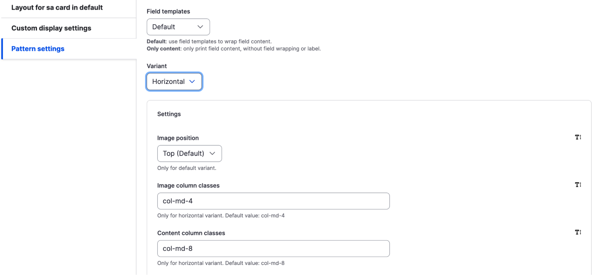
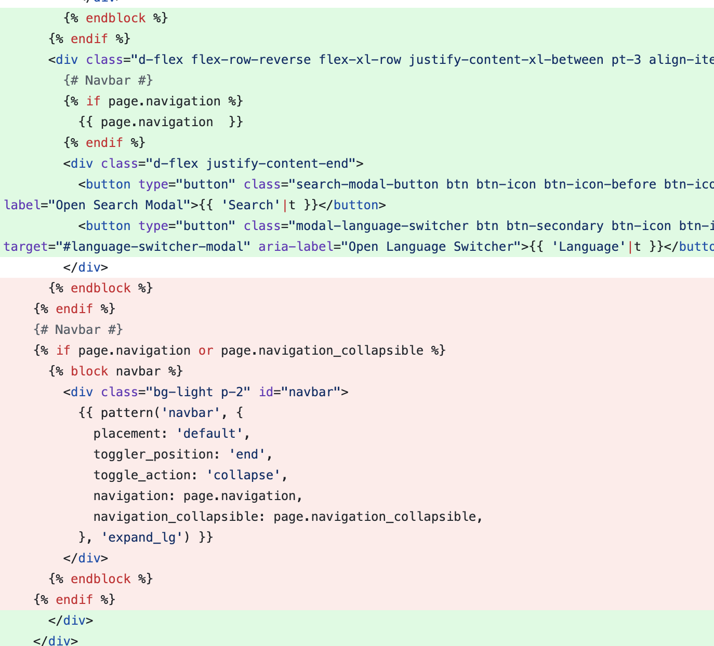
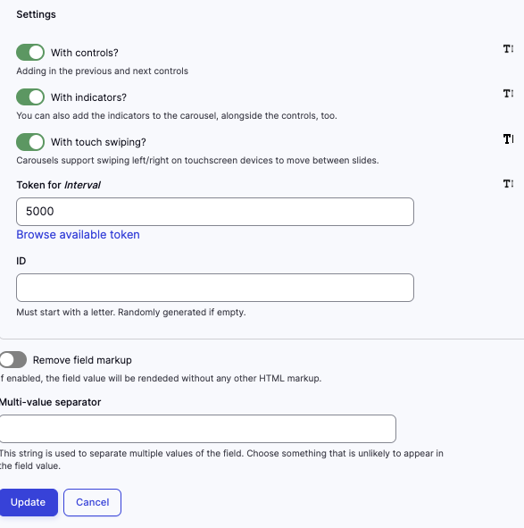
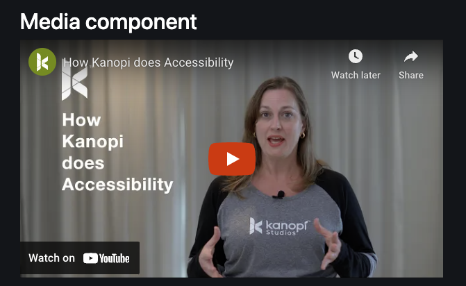
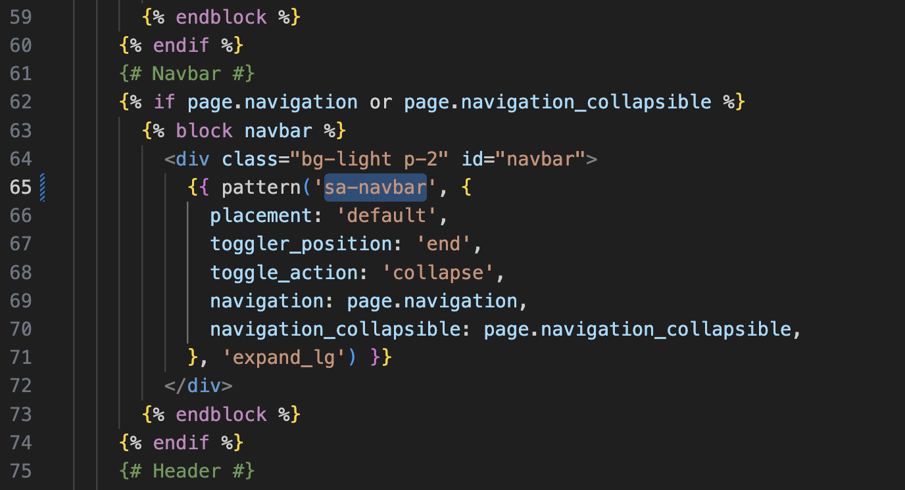
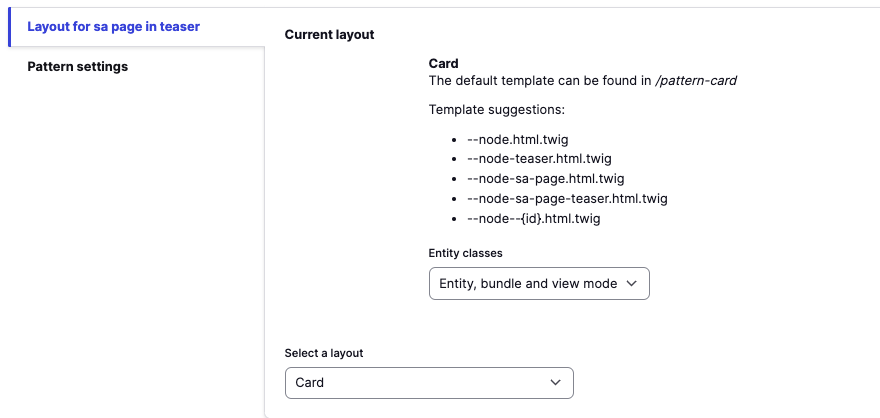

# Saplings Developer Documentation


## Table of Contents


[TOC]


## Introduction

Once Saplings is installed on your environment, as it is done via recipes and not modules for the content types, components and themes,  you are free to remove content types and components or modify their display as you wish.  The child theme is also yours to modify.  You can easily rename the label of components and remove styles from the components.  For example, if you prefer the name “LIghtly toasted cheese sandwich” over “Multi-Item Carousel,” change the label of the component to your heart's content.   We recommend that you retain the padding and margin fields, set defaults for them, and then hide them from the form display if you don’t wish to allow the clients to alter them.   You can also set default widths on components and the container width. Removing the fields will mean you must make more adjustments within the theme templates, so just setting defaults and removing them from the form display will suffice.  We recommend keeping the keys for the settings. Still, if you would like to update the names of, for example, background colors to Red and Green instead of Primary and Secondary (it’s gonna look like a Christmas tree, but go for it), this can be done and added to your site’s configuration.  The theme will still use the bootstrap variables to display the correct colors. Now go hog wild and make this site your own!

## Adding a megamenu to Saplings


### Adding The Better Megamenu to Saplings site as done on SettleIn

1. Install TB Megamenu and set up your menu
    1. I used "drupal/tb_megamenu": "^3.0@alpha",
    2. But on Parks there was an issue that we needed to use the dev version for: [https://www.drupal.org/project/tb_megamenu/issues/3441346](https://www.drupal.org/project/tb_megamenu/issues/3441346) 


2. Remove Main navigation block from the block layout and put the TB megamenu block there instead
3. Add a tb-megamenu-nav.html.twig template file to add a language switcher button

```
<ul {{ attributes }} >
 
   {{ li }}
 
</ul>
<button type="button" class="modal-language-switcher btn btn-secondary btn-icon btn-icon-before btn-icon-after btn-icon-translate w-100 justify-content-center" data-bs-target="#language-switcher-modal" aria-label="Open Language Switcher">{{ 'Language'|t }}</button>
```

4. Add tb-megamenu.html.twig template to customize the mobile toggle button

```

<style type="text/css">
.tbm.animate .tbm-item > .tbm-submenu, .tbm.animate.slide .tbm-item > .tbm-submenu > div {
 {{ css_style }}
 }
</style>

<nav {{ attributes }}>
 
   <div class="mobile-menu-button">
     <button class="tbm-button btn btn-secondary btn-icon btn-icon-after btn-icon-chevron-down" type="button" data-bs-target="#menu-modal" aria-label="Open Main Menu"><span class="open-menu">{{ 'Menu'|t }}</span><span class="close-menu">{{ 'Close'|t }}</span>
     </button>
   </div>
   <div class="tbm-collapse {{ block_config['always-show-submenu'] ? ' always-show' : '' }}">
 
 {{ content }}
 
   </div>
 
</nav>

<script>
{# Add the .tbm--mobile class before there is a chance for a flash of unstyled content. #}

if (window.matchMedia("(max-width: {{ block_config['breakpoint']}}px)").matches) {
 document.getElementById("{{ attributes.id }}").classList.add('tbm--mobile');
}

{# Add the .tbm--mobile-hide class if needed. #}

 document.getElementById('{{ attributes.id }}').classList.add('tbm--mobile-hide');
```

5. Remove the navbar pattern from the page.html.twig template and just print the region you put the TB megamenu in


6. Here is the SCSS used to style the tbm menu on SettleIn

```
.tbm {
 background-color: transparent;
 .tbm-button {
   display: none;
 }
}

.tbm-submenu {
 top: calc(100% + 1.5rem);
 border-radius: 2rem;
 border: none;
 padding: 3rem;

 @media (max-width: 1400px) {
   width: 1118px;
   left: -172px;
 }

 @media (min-width: 1400px) {
   width: 1296px;
   left: -172px;
 }

 .tbm-row:nth-child(2), .tbm-row:nth-child(3) {
   border-top: 1px solid #B7D0C64D;
   margin-top: 2rem;
   padding-top: 2rem;
 }

 .tbm-group-container {
   border-top: 0;
 }

 .tbm-group-title {
   text-transform: none;
   font-size: 1.5rem;
 }
}

.tbm-collapse {
 .modal-language-switcher {
   display: none;
 }
}

.tbm-item.level-1 {
 border: none;
 .tbm-link.level-1 {
   margin: 0 2rem 0 0;
   padding: 0;
   font-family: 'Literata', serif;
   font-size: 1.125rem;
   &:hover {
     background-color: transparent;
   }
 }
}

.tbm-item.level-1:nth-child(2) {
 .tbm-subnav.level-1 {
   columns: 4;
 }
}

.tbm-item--has-dropdown.level-1 {
 .tbm-link.level-1{
   &::after {
     display: inline-block;
     font-family: bootstrap-icons !important;
     font-style: normal;
     font-weight: bold !important;
     line-height: 1;
     font-size: 1rem;
     content: '\F282';
     margin-left: 0.5rem;
     color: $settle-blue;
     transition-duration: 300ms;
     transition-timing-function: ease-in-out;
   }
 }

 &.open {
   .tbm-link.level-1{
     &::after {
       rotate: 180deg;
       transition-duration: 300ms;
       transition-timing-function: ease-in-out;
     }
   }
 }

 .tbm-submenu-toggle{
   &:hover {
     background-color: transparent;
   }
 }

 .tbm-link.level-2 {
   font-weight: 700;
 }
}

.tbm.tbm--mobile .tbm-button {
 display: inline-flex;
 margin-bottom: 0;
 span {
   font-weight: 700;
 }

 .close-menu {
   display: none;
 }
}

.navbar-toggler {
 display: none;
}
.tbm.tbm--mobile {
 overflow: scroll;
 .tbm-item {
   border-top: none;
   padding: 1rem;
 }

 .tbm-item.level-1:nth-child(2) .tbm-subnav.level-1 {
   columns: 1;
 }

 .tbm-nav {
   background-color: transparent;
   .tbm-item.level-1 {
     .tbm-link.level-1  {
       font-family: 'DM Sans', sans-serif;
       margin-right: 0;
       justify-content: space-between;
       font-size: 1.5rem;
       font-weight: 700;

       &::after {
         font-size: 1.5rem;
       }
     }
   }
 }

 .tbm-submenu-toggle {
   display: none;
 }

 .tbm-submenu {
   background: transparent;
   border: none;
   .tbm-link {
     padding: 0;
   }
 }

 .tbm-link.level-2 {
   font-size: 1.125rem;
   font-weight: 400;
 }

 .tbm-group-title {
   font-weight: 700;
 }

 .tbm-item.level-1:nth-child(3) {
   .tbm-link.level-2 {
     font-weight: 700;
   }
 }


 .tbm-row:nth-child(2), .tbm-row:nth-child(3) {
   border-top: none;
 }
}

.tbm--mobile-show {
 position: fixed;
 top: 0;
 left: 0;
 width: 100%;
 height: 100%;
 background: linear-gradient(rgba(235, 255, 242, 1), rgba(250, 255, 252, 1));
 z-index: 12;

 .close-menu {
   display: block !important;
 }

 .open-menu {
   display: none;
 }

 .tbm-collapse  {
   display: block;
   position: unset !important;
   background: transparent !important;
   --bs-gutter-x: 1.5rem;
   --bs-gutter-y: 0;
   width: 100%;
   padding-right: calc(var(--bs-gutter-x)* 0.5);
   padding-left: calc(var(--bs-gutter-x)* 0.5);
   margin-right: auto;
   margin-left: auto;

   @media (min-width: 576px) {
     max-width: 540px;
   }

   @media (min-width: 768px) {
     max-width: 720px;
   }

   @media (min-width: 992px) {
     max-width: 960px;
   }

   .modal-language-switcher {
     display: inline-flex;
   }
 }

 .mobile-menu-button {
   position: relative;
   height: 54px;

   margin-top: 24px;
   --bs-gutter-x: 1.5rem;
   --bs-gutter-y: 0;
   width: 100%;
   padding-right: calc(var(--bs-gutter-x)* 0.5);
   padding-left: calc(var(--bs-gutter-x)* 0.5);
   margin-right: auto;
   margin-left: auto;

   @media (min-width: 576px) {
     max-width: 540px;
   }

   @media (min-width: 768px) {
     max-width: 720px;
   }

   @media (min-width: 992px) {
     max-width: 960px;
   }

   button {
     position: absolute;
     right: 12px;

     &::after {
       content: '\F62A' !important;
     }
   }
 }
```

## Adding a Language Switcher to Saplings site (As done on SettleIn)

1. Add Language Switcher (Content) block to the Block Layout in the Programmatically Placed region.
2. Add a modal to the page.html.twig template with the block placed in it with twig tweak
3. Add a tb-megamenu-nav.html.twig template file to add a language switcher button
4. Add js to toggle open/close the language switcher
5. Add styles to the modal
6. To get each language to display in it’s own Language (Español not Spanish), in /admin/config/regional/language, Edit each language and update the Language name to be the translated version.


## Search

There is an addon recipe for Solr: [https://github.com/kanopi/saplings-solr](https://github.com/kanopi/saplings-solr)

This will configure solr search for the 2 content types that come with the base install.  Pages and Posts.  A view will be created that displays the content in a 4 column grid on desktop and a one column grid on mobile.  Be sure to enable solr on your Pantheon instance for this to work correctly.  In addition a stylized search form will display in the header of your site that opens in a modal


# Content Types


## Page 

The page content types comes with the following fields:

**Title: **The page title also used for the SEO page title

**Description:** Used on the teaser display as well as the SEO meta description

**Featured Image:** Used at the top of the page as a header as well as the card image on the teaser display

**Overlay:** Changes the overlay over the image and the text color of the header and summary text

Options:


* Light - 90%
* Light - 75%
* Light - 50%
* Light - 25%
* Dark - 90%
* Dark - 75%
* Dark - 50%
* Dark - 25%

**Header Position:** Places the title and description in the header section

Options: 


* Top
* Middle 
* Bottom

**Hide Header Section:** Used to hide the page title and image and summary so that paragraphs can be used instead to place content

**Author**

**Author URL**

**External Source**

**Components: **All available components that are outlined above.

**Relationships:** Used to add related posts

**SEO Page Title:** Optional field to override the page title displayed for Search Engines and Social Media

**SEO Image:** Optional field to override the Image displayed for Search Engines and Social Media

**SEO Description:** Optional field to override the page description displayed for Search Engines and Social Media

**Robots meta tag:** Optional field to add no-index or no-follow if the user prefers to hide pages from the search engines.

[Adding Content and Styling to a Page - Watch Video](https://www.loom.com/share/4c4c15d3730f43f3b5409cbc707298f9)


<p id="gdcalert4" ><span style="color: red; font-weight: bold">>>>>>  gd2md-html alert: inline image link here (to assets/images/image4.gif). Store image on your image server and adjust path/filename/extension if necessary. </span><br>(<a href="#">Back to top</a>)(<a href="#gdcalert5">Next alert</a>)<br><span style="color: red; font-weight: bold">>>>>> </span></p>


## Post

The post content types comes with the following fields:

**Title: **The page title also used for the SEO page title

**Description:** Used on the teaser display as well as the SEO meta description

**Featured Image:** Used at the top of the page as a header as well as the card image on the teaser display

**Overlay:** Changes the overlay over the image and the text color of the header and summary text

Options:


* Light - 90%
* Light - 75%
* Light - 50%
* Light - 25%
* Dark - 90%
* Dark - 75%
* Dark - 50%
* Dark - 25%

  

**Header Position:** Places the title and description in the header section

Options: 


* Top
* Middle
* Bottom

**Hide Header Section:** Used to hide the page title and image and summary so that paragraphs can be used instead to place content

**Author**

**Author URL**

**External Source**

**Body**

**Relationships:** Used to add related posts

**SEO Page Title:** Optional field to override the page title displayed for Search Engines and Social Media

**SEO Image:** Optional field to override the Image displayed for Search Engines and Social Media

**SEO Description:** Optional field to override the page description displayed for Search Engines and Social Media

**Robots meta tag:** Optional field to add no-index or no-follow if the user prefers to hide pages from the search engines.


## Event

The event content types comes with the following fields:

**Title: **The page title also used for the SEO page title

**Description:** Used on the teaser display as well as the SEO meta description

**Featured Image:** Used at the top of the page as a header as well as the card image on the teaser display

**Overlay:** Changes the overlay over the image and the text color of the header and summary text

Options:


* Light - 90%
* Light - 75%
* Light - 50%
* Light - 25%
* Dark - 90%
* Dark - 75%
* Dark - 50%
* Dark - 25%

  

**Header Position:** Places the title and description in the header section

Options: 


* Top
* Middle
* Bottom

**Hide Header Section:** Used to hide the page title and image and summary so that paragraphs can be used instead to place content

**Date**

**Attendance Mode**

Options:


* In Person
* Online
* Mixed

**Availability**

Options:


* In Stock
* Sold Out
* Pre Order

**Location**

**Register LInk**

**Category**

**Cost**

**Currency**

**Components**

**Body**

**SEO Page Title:** Optional field to override the page title displayed for Search Engines and Social Media

**SEO Image:** Optional field to override the Image displayed for Search Engines and Social Media

**SEO Description:** Optional field to override the page description displayed for Search Engines and Social Media

**Robots meta tag:** Optional field to add no-index or no-follow if the user prefers to hide pages from the search engines.


# Menus


## Banner 

Placed above the main menu section


## Social

Placed in the footer section between the legal and Footer Menus.  To add a social media icon to the menu, click in the Bootstrap Icon field and search for the icon you are looking for, i.e. Facebook or Instagram.  Choose your icon. To display only the icon, choose “Without text” under the Appearance dropdown.  The icons are provided by this module.  [https://www.drupal.org/project/menu_bootstrap_icon](https://www.drupal.org/project/menu_bootstrap_icon)


## Main Menu

The base install sllows for No link parent level menu items that are displayed as a dropdown on click on desktop devices.

**Options: **


* sa-navbar: Allows the parent item to be a link and then have a dropdown indicator to access child menu items.
* Necessary module https://github.com/kanopi/saplings_navbar

This can be set by editing the /saplings_child/templates/overrides/page.html.twig template and switching out the pattern used for **sa-navbar**.


<p id="gdcalert5" ><span style="color: red; font-weight: bold">>>>>>  gd2md-html alert: inline image link here (to assets/images/image5.png). Store image on your image server and adjust path/filename/extension if necessary. </span><br>(<a href="#">Back to top</a>)(<a href="#gdcalert6">Next alert</a>)<br><span style="color: red; font-weight: bold">>>>>> </span></p>


## Legal 

Displays below the footer menu


## Footer

Displays menu links in the footer

[Saplings Built-in Menus - Watch Video](https://www.loom.com/share/d0ccb3745b284b6285af1f1817813ab3)


<p id="gdcalert6" ><span style="color: red; font-weight: bold">>>>>>  gd2md-html alert: inline image link here (to assets/images/image6.gif). Store image on your image server and adjust path/filename/extension if necessary. </span><br>(<a href="#">Back to top</a>)(<a href="#gdcalert7">Next alert</a>)<br><span style="color: red; font-weight: bold">>>>>> </span></p>


# Media Types


## Document


## Video


## Remote Video


## Image


### Responsive Image styles


* 5:4
* 16:3
* 16:9

**More coming in Phase 2*

[Sapling Media Types and Responsive Image Styles - Watch Video](https://www.loom.com/share/999be51038f94b57a2e4da27e2a15c17)


<p id="gdcalert7" ><span style="color: red; font-weight: bold">>>>>>  gd2md-html alert: inline image link here (to assets/images/image7.gif). Store image on your image server and adjust path/filename/extension if necessary. </span><br>(<a href="#">Back to top</a>)(<a href="#gdcalert8">Next alert</a>)<br><span style="color: red; font-weight: bold">>>>>> </span></p>


# Components


## Component Styles Overview

<p id="gdcalert8" ><span style="color: red; font-weight: bold">>>>>>  gd2md-html alert: inline image link here (to assets/images/image8.png). Store image on your image server and adjust path/filename/extension if necessary. </span><br>(<a href="#">Back to top</a>)(<a href="#gdcalert9">Next alert</a>)<br><span style="color: red; font-weight: bold">>>>>> </span></p>


Each paragraph comes with a set of styles that can be updated for the display of that section.  The styles are nested in a dropdown section below each of the paragraph edit forms. Included styles are listed below.

**Margin**

Options:


* Top and Bottom Small
* Top and Bottom Medium
* Top and Bottom Large
* Top Small
* Top Medium
* Top Large
* Bottom Small
* Bottom Medium
* Bottom Large

**Padding**

Options:


* Top and Bottom Small
* Top and Bottom Medium
* Top and Bottom Large
* Top Small
* Top Medium
* Top Large
* Bottom Small
* Bottom Medium
* Bottom Large

**Container**

Options:


* Standard (this is the standard container width)
* Container Fluid (this will cause the container to be full width

**Width**

Options:


* 75%
* 50%
* 33%
* 25%

**Background**

Options:


* Primary
* Secondary
* Dark
* Light

The default options can be altered after installation.  Currently the only options that have default settings are:


* Padding: Top and Bottom Medium
* Container: Standard


##  \
Accordion (and Accordion Item)


1. To add an accordion paragraph type, create a new Page content.
2. From the Components dropdown, choose an accordion
3. Add a Header and a description if you would like
4. Add individual Accordion Items.  
5. Styles that are set on the Accordion will affect the entire accordion section


<p id="gdcalert9" ><span style="color: red; font-weight: bold">>>>>>  gd2md-html alert: inline image link here (to assets/images/image9.png). Store image on your image server and adjust path/filename/extension if necessary. </span><br>(<a href="#">Back to top</a>)(<a href="#gdcalert10">Next alert</a>)<br><span style="color: red; font-weight: bold">>>>>> </span></p>


## Block 


1. To add a Block paragraph type, create a new Page content.
2. From the Components dropdown, choose a Block
3. Add a Header and a description if you would like
4. Choose the block that you would like to display 
5. Styles that are set on the Block will affect the entire Block section

Fields: 


* Title
* Description
* Block

Styles: 


* Background
* Width
* Margin
* Padding - Default is Top and Bottom Medium
* Container - Default is Standard Container


<p id="gdcalert10" ><span style="color: red; font-weight: bold">>>>>>  gd2md-html alert: inline image link here (to assets/images/image10.png). Store image on your image server and adjust path/filename/extension if necessary. </span><br>(<a href="#">Back to top</a>)(<a href="#gdcalert11">Next alert</a>)<br><span style="color: red; font-weight: bold">>>>>> </span></p>





## Card


1. To add a Card paragraph type, when editing Page content, from the Components dropdown, choose a Card.
2. Add a Header for the Card Title and a description for the card body
3. Add media for the card image
4. Add a link to display a link in the card footer.


<p id="gdcalert11" ><span style="color: red; font-weight: bold">>>>>>  gd2md-html alert: inline image link here (to assets/images/image11.png). Store image on your image server and adjust path/filename/extension if necessary. </span><br>(<a href="#">Back to top</a>)(<a href="#gdcalert12">Next alert</a>)<br><span style="color: red; font-weight: bold">>>>>> </span></p>


### For Developers:

To alter the display of your card to Horizontal, go to the Manage Display Tab, Click on Pattern Settings, and for the Variant dropdown, choose Horizontal.

<p id="gdcalert12" ><span style="color: red; font-weight: bold">>>>>>  gd2md-html alert: inline image link here (to assets/images/image12.png). Store image on your image server and adjust path/filename/extension if necessary. </span><br>(<a href="#">Back to top</a>)(<a href="#gdcalert13">Next alert</a>)<br><span style="color: red; font-weight: bold">>>>>> </span></p>


To alter the display of the link for your card, in the Manage display tab, Edit the pattern variant for the link. The Variant determines which bootstrap button style variable will be printed.  


<p id="gdcalert13" ><span style="color: red; font-weight: bold">>>>>>  gd2md-html alert: inline image link here (to assets/images/image13.png). Store image on your image server and adjust path/filename/extension if necessary. </span><br>(<a href="#">Back to top</a>)(<a href="#gdcalert14">Next alert</a>)<br><span style="color: red; font-weight: bold">>>>>> </span></p>





 \
In addition, there is a setting that allows you to link the entire card, or to turn that off.  

<p id="gdcalert14" ><span style="color: red; font-weight: bold">>>>>>  gd2md-html alert: inline image link here (to assets/images/image14.png). Store image on your image server and adjust path/filename/extension if necessary. </span><br>(<a href="#">Back to top</a>)(<a href="#gdcalert15">Next alert</a>)<br><span style="color: red; font-weight: bold">>>>>> </span></p>


Slots:


* Image
* Header
* Content
* Footer


## Filtered List

A filtered list component displays predefined views.  

Fields: 


* Title
* Description
* Filtered List Dropdown
* Display
* Options

Styles:


* Background
* Width
* Margin
* Padding - Default is Top and Bottom Medium
* Container - Default is Standard Container


## Text

A text component allows for text to be added to a page with a wysiwyg editor.  

Fields: 


* Title
* Description

Styles: 


* Background
* Width
* Margin
* Padding - Default is Top and Bottom Medium
* Container - Default is Standard Container


## 

<p id="gdcalert15" ><span style="color: red; font-weight: bold">>>>>>  gd2md-html alert: inline image link here (to assets/images/image15.png). Store image on your image server and adjust path/filename/extension if necessary. </span><br>(<a href="#">Back to top</a>)(<a href="#gdcalert16">Next alert</a>)<br><span style="color: red; font-weight: bold">>>>>> </span></p>


## Columns

A columns component allows for a text, card, block, media, carousel and block component to be added as columns..  

Fields: 


* Title
* Description
* Column Items

Styles: 


* Background
* Width
* Margin
* Padding - Default is Top and Bottom Medium
* Container - Default is Standard Container
* Columns Mobile
* Columns Desktop
* Columns Tablet
* Column Gutters
* Justify Content
* Align Items


<p id="gdcalert16" ><span style="color: red; font-weight: bold">>>>>>  gd2md-html alert: inline image link here (to assets/images/image16.png). Store image on your image server and adjust path/filename/extension if necessary. </span><br>(<a href="#">Back to top</a>)(<a href="#gdcalert17">Next alert</a>)<br><span style="color: red; font-weight: bold">>>>>> </span></p>


## Media

A media component allows for either an image or video media entity to be added. 

Fields:


* Title
* Description
* Media

Styles:


* Background
* Width
* Margin
* Padding - Default is Top and Bottom Medium
* Container - Default is Standard Container

Remote Video Example


<p id="gdcalert17" ><span style="color: red; font-weight: bold">>>>>>  gd2md-html alert: inline image link here (to assets/images/image17.png). Store image on your image server and adjust path/filename/extension if necessary. </span><br>(<a href="#">Back to top</a>)(<a href="#gdcalert18">Next alert</a>)<br><span style="color: red; font-weight: bold">>>>>> </span></p>


## Tabs

A tabs component allows for multiple tabs to be added to display content in a tabbed display that will show and hide tabbed content on click.

The Tabs Component has the following fields:

Fields: 


* Title
* Description
* Tab Item

Styles: 


* Background
* Width
* Margin
* Padding - Default is Top and Bottom Medium
* Container - Default is Standard Container


<p id="gdcalert18" ><span style="color: red; font-weight: bold">>>>>>  gd2md-html alert: inline image link here (to assets/images/image18.png). Store image on your image server and adjust path/filename/extension if necessary. </span><br>(<a href="#">Back to top</a>)(<a href="#gdcalert19">Next alert</a>)<br><span style="color: red; font-weight: bold">>>>>> </span></p>


## Carousel

A Carousel component allows for multiple media items to be displayed in a carousel

The Carousel Component has the following fields:

Fields: 


* Title
* Description
* Carousel Item

Styles: 


* Background
* Width
* Margin
* Padding - Default is Top and Bottom Medium
* Container - Default is Standard Container

The carousel settings are defined by the Carousel Pattern being used on the Manage Display page of the paragraph. /admin/structure/paragraphs_type/sa_carousel/display

The Carousel Item field is using the pattern of Carousel.

Available options are: 


* With Controls
* With Indicators
* With touch Swiping
* Token for Interval
* ID


<p id="gdcalert19" ><span style="color: red; font-weight: bold">>>>>>  gd2md-html alert: inline image link here (to assets/images/image19.png). Store image on your image server and adjust path/filename/extension if necessary. </span><br>(<a href="#">Back to top</a>)(<a href="#gdcalert20">Next alert</a>)<br><span style="color: red; font-weight: bold">>>>>> </span></p>


The referenced Carousel Item Paragraph type is using the pattern of Carousel Item which has the following slots:


* Image
* Caption

To manage the display, visit this URL `admin/structure/paragraphs_type/sa_carousel_item/display`

On the display page you can also alter the image style that is loaded.


<p id="gdcalert20" ><span style="color: red; font-weight: bold">>>>>>  gd2md-html alert: inline image link here (to assets/images/image20.png). Store image on your image server and adjust path/filename/extension if necessary. </span><br>(<a href="#">Back to top</a>)(<a href="#gdcalert21">Next alert</a>)<br><span style="color: red; font-weight: bold">>>>>> </span></p>


<p id="gdcalert21" ><span style="color: red; font-weight: bold">>>>>>  gd2md-html alert: inline image link here (to assets/images/image21.png). Store image on your image server and adjust path/filename/extension if necessary. </span><br>(<a href="#">Back to top</a>)(<a href="#gdcalert22">Next alert</a>)<br><span style="color: red; font-weight: bold">>>>>> </span></p>





## Side By Side

The side by side component offers a header, text field and a media field for displaying the content.  The default display of content is the Media on the left and the Header and Description on the right.  The columns will display as equal columns.  If the Boolean for Reverse Order is turned on, The Media will display on the right side instead.


<p id="gdcalert22" ><span style="color: red; font-weight: bold">>>>>>  gd2md-html alert: inline image link here (to assets/images/image22.png). Store image on your image server and adjust path/filename/extension if necessary. </span><br>(<a href="#">Back to top</a>)(<a href="#gdcalert23">Next alert</a>)<br><span style="color: red; font-weight: bold">>>>>> </span></p>


Fields: 


* Header
* Description
* Media

Styles: 


* Background
* Width
* Margin
* Padding - Default is Top and Bottom Medium
* Container - Default is Standard Container
* Reverse Order


## Hero

The hero components allows for either a background video or image and a text overlay.  

 \
Example here at the bottom of the page:

https://dev-saplingscms.pantheonsite.io/


<p id="gdcalert23" ><span style="color: red; font-weight: bold">>>>>>  gd2md-html alert: inline image link here (to assets/images/image23.png). Store image on your image server and adjust path/filename/extension if necessary. </span><br>(<a href="#">Back to top</a>)(<a href="#gdcalert24">Next alert</a>)<br><span style="color: red; font-weight: bold">>>>>> </span></p>





Fields: 


* Header
* Description
* Media

Styles: 


* Background
* Width
* Margin
* Padding - Default is Top and Bottom Medium
* Container - Default is Standard Container
* Reverse Order


# Developer Documentation

The `saplings_child` theme is a child theme of the `ui_suite_bootstrap` theme. The majority of the patterns and templates are coming from the `ui_suite_bootstrap` theme. However some custom patterns and templates have been added to the `saplings_child` theme for our use cases. There is a base paragraph template located in the `saplings_child/templates/overrides/paragraphs` directory.


## Patterns

New custom patterns should be created in the `templates/patterns` folder of your active theme.

To use patterns to display content, you will need a `.yml` file which will define your available settings, your fields (aka slots) where you will be able to place fields with your defined pattern, and a twig template to display your content in drupal.

Here is an example .`yml` field which shows the available settings and also fields for a simple card: \
[https://github.com/kanopi/saplings_child/blob/main/templates/patterns/simple_card/simple_card.ui_patterns.yml](https://github.com/kanopi/saplings_child/blob/main/templates/patterns/simple_card/simple_card.ui_patterns.yml)

Here is an example of a twig template for the display of the card: \
[https://github.com/kanopi/saplings_child/blob/main/templates/patterns/simple_card/pattern-simple-card.html.twig](https://github.com/kanopi/saplings_child/blob/main/templates/patterns/simple_card/pattern-simple-card.html.twig)

If you have also set up a `preview.html.twig` file like this:

[https://github.com/kanopi/saplings_child/blob/main/templates/patterns/simple_card/pattern-simple-card--preview.html.twig](https://github.com/kanopi/saplings_child/blob/main/templates/patterns/simple_card/pattern-simple-card--preview.html.twig) then you should be able to view your pattern at the following url on your site.  /patterns

For example, all current patterns can be seen here as a preview:  [https://dev-saplingscms.pantheonsite.io/patterns](https://dev-saplingscms.pantheonsite.io/patterns)

If set up correctly, patterns can also be viewed as stand alone items:  [https://dev-saplingscms.pantheonsite.io/patterns/blockquote](https://dev-saplingscms.pantheonsite.io/patterns/blockquote)


### Configuring the entire entity as a pattern

Patterns can be used by configuring the entire entity to display as a pattern, such as we do with the Node teasers `/admin/structure/types/manage/sa_page/display/teaser`


<p id="gdcalert24" ><span style="color: red; font-weight: bold">>>>>>  gd2md-html alert: inline image link here (to assets/images/image24.png). Store image on your image server and adjust path/filename/extension if necessary. </span><br>(<a href="#">Back to top</a>)(<a href="#gdcalert25">Next alert</a>)<br><span style="color: red; font-weight: bold">>>>>> </span></p>


In this example, the Page Teaser is set to using a Card layout.

<p id="gdcalert25" ><span style="color: red; font-weight: bold">>>>>>  gd2md-html alert: inline image link here (to assets/images/image25.png). Store image on your image server and adjust path/filename/extension if necessary. </span><br>(<a href="#">Back to top</a>)(<a href="#gdcalert26">Next alert</a>)<br><span style="color: red; font-weight: bold">>>>>> </span></p>





This can also be done on a paragraph like we do on the paragraph carousel item display as seen here:


```
/admin/structure/paragraphs_type/sa_carousel_item/display
```


Under Pattern Settings, choose your desired layout.  Once you have saved the change, you will be presented with the available slots for your pattern.  From there you can drag and drop the fields into the preferred slots.


<p id="gdcalert26" ><span style="color: red; font-weight: bold">>>>>>  gd2md-html alert: inline image link here (to assets/images/image26.png). Store image on your image server and adjust path/filename/extension if necessary. </span><br>(<a href="#">Back to top</a>)(<a href="#gdcalert27">Next alert</a>)<br><span style="color: red; font-weight: bold">>>>>> </span></p>


### Configuring Fields as a pattern

Patterns can also be used to display fields as a pattern, like can be seen here `/admin/structure/paragraphs_type/sa_carousel/display`

[Displaying Patterns and Field Templates - Watch Video](https://www.loom.com/share/32b8cb87b1fc450a8fe27a51275fa709)


<p id="gdcalert27" ><span style="color: red; font-weight: bold">>>>>>  gd2md-html alert: inline image link here (to assets/images/image27.gif). Store image on your image server and adjust path/filename/extension if necessary. </span><br>(<a href="#">Back to top</a>)(<a href="#gdcalert28">Next alert</a>)<br><span style="color: red; font-weight: bold">>>>>> </span></p>


### Configuring Field groups as a pattern

Another way to display something as a pattern is to do so as a field group.  To do this:


1. On the entity type you are editing, click **Add Field Group**  
2. From the dropdown list, choose Pattern and add your Field group label 
3. Drag your group into its desired location on the Manage display page
4. Arrange the fields in the order that you would like them to display in the pattern slots

[Manage display | Drush Site-Install - 7 March 2024 - Watch Video](https://www.loom.com/share/e73273e5362941e7b76c2276a8a58719)


<p id="gdcalert28" ><span style="color: red; font-weight: bold">>>>>>  gd2md-html alert: inline image link here (to assets/images/image28.gif). Store image on your image server and adjust path/filename/extension if necessary. </span><br>(<a href="#">Back to top</a>)(<a href="#gdcalert29">Next alert</a>)<br><span style="color: red; font-weight: bold">>>>>> </span></p>


## Colors and theme settings

Updating the colors and the theme settings can be done on this page 


```
/admin/appearance/css-variables/saplings_child
```


Available options are many, but some of the most used variables will be for Button and Color variants.  If there is a bootstrap variable you would like to update, check in the available variables that the theme offers before attempting to alter those variables in  your theme.

Theme settings will be stored in a configuration `.yml` file. 

Note that some variables can be set only as  RBG variables while some allow for Hex variables. At this time you are not able to copy and paste your hex key color codes into the options boxes so this will need to be done manually.

To quickly convert your [HEX variables to RGB](https://www.rapidtables.com/convert/color/hex-to-rgb.html)

[Updating Color Variables in Your Site - Watch Video](https://www.loom.com/share/44e2ae132ac1442db61c6a5e8a5a98fa)


<p id="gdcalert29" ><span style="color: red; font-weight: bold">>>>>>  gd2md-html alert: inline image link here (to assets/images/image29.gif). Store image on your image server and adjust path/filename/extension if necessary. </span><br>(<a href="#">Back to top</a>)(<a href="#gdcalert30">Next alert</a>)<br><span style="color: red; font-weight: bold">>>>>> </span></p>


